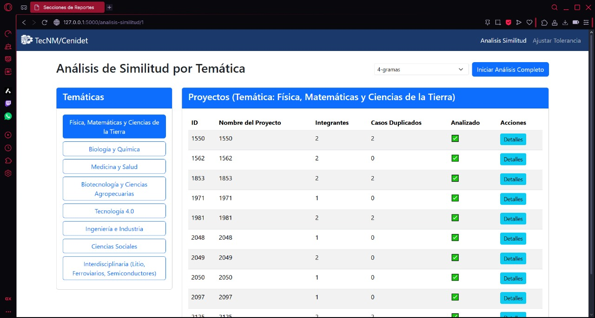
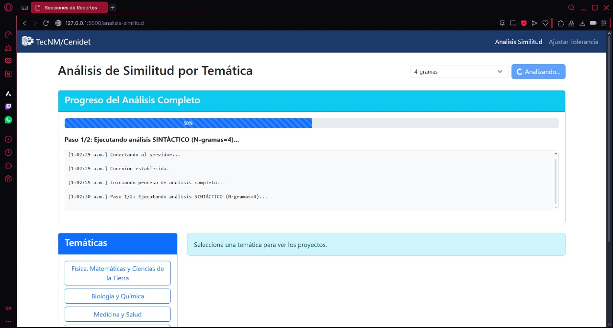
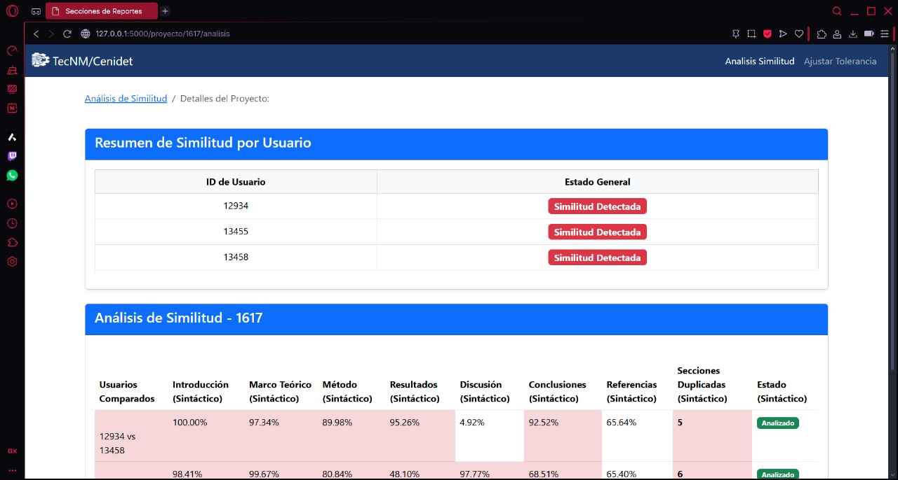
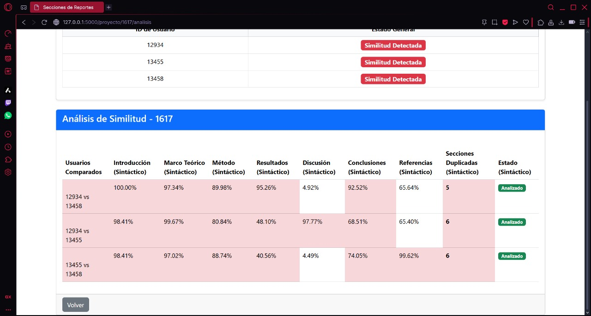
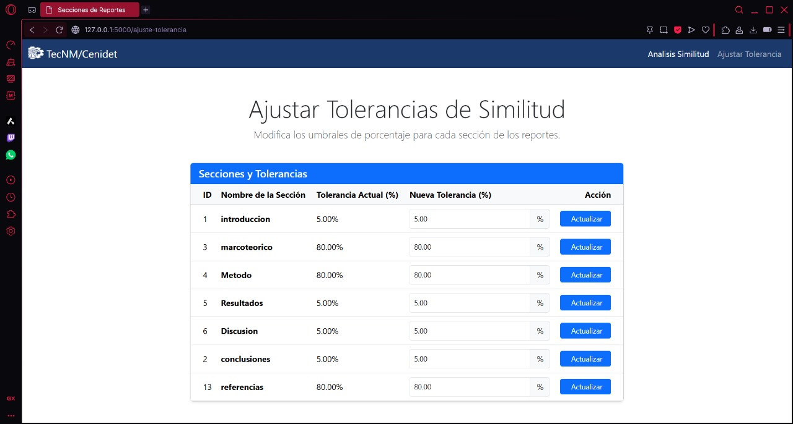

# 🔎 Detección de Plagio en Reportes Científicos

## 📖 Descripción del Proyecto
Este proyecto tiene la capacidad de analizar reportes que sean registrados en este evento, solo aplica el analisis entre reportes que sean del mismo proyecto. Al realizar los análisis aplica lo siguiente:
- Agrupa los reportes por proyectos.
- Prepocesa el texto.
- Elimina Stopwords.
- Lematiza
- Vectoriza
- Aplica Similitud Coseno

Este análisis se aplica a todos los reportes en cuestion de minutos, los datos son extraídos de una base de datos donde se almacenan las siguientes secciones:

- Introducción
- Marco Teórico
- Método
- Resultados
- Discusión
- Conclusiones
- Referencias

Tambien tiene implementada una sección para modificar el umbral de tolerancia de similitud para cada sección.

---

## 🛠️ Tecnologías Utilizadas
- **Backend:** Python, Flask, Spacy, Scikit-learn
- **Modelos:** sentence - BERT
- **Frontend:** HTML, CSS, JavaScript
- **Base de Datos:** MySQL

## 📸 Capturas de Pantalla

### Página Principal

### Análisis de Similitud

### Detalles de Similitud

### Ajuste de Tolerancia

